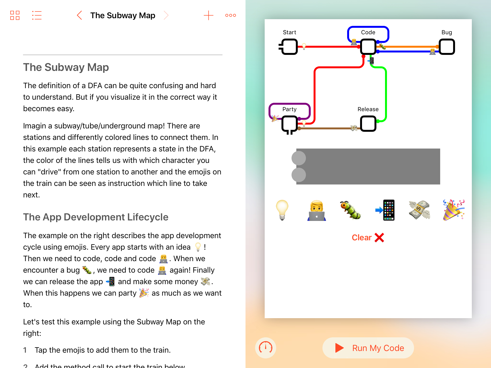

# Deterministic Finite Automaton

A [Deterministic Finite Automaton](https://en.wikipedia.org/wiki/Deterministic_finite_automaton) (short DFA) is a finite state machine, that checks if a string of characters follows certain rules. It's bascally another way to represent a [Regular Expression](https://en.wikipedia.org/wiki/Regular_expression), but just have a look at the *Swift Playground Book* if you want to learn more.

## How to get the Playground Book

- Just download the [Swift Playground](https://www.apple.com/swift/playgrounds/) App.
- Then download the Playground Book [here](https://github.com/leoMehlig/DFA/releases/download/1.1/DFA.playgroundbook.zip) on your iPad.

## My WWDC19 Scholarship Application

I built this *Playground Book* in a few days as part of my [WWDC19 Scholarship Application](https://developer.apple.com/wwdc19/scholarships/) and luckily got accepted!
